# Credit_Risk_Analysis

## Overview
The purpose of this challenge is to apply our machine learning skills to help sovle a real-world challenge: credit card risk.  By employing different techniques to train and evaluate models with umblanced classes we will develop a final recommendation on which, if any, models are the best for future use.

## Machine Learning Model Results

### Naive Random Oversampling

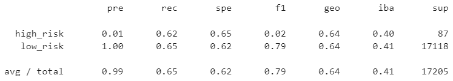

- Balanced Accuracy: 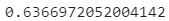
- Precision:
- Recall:

### SMOTE Oversampling

- Balanced Accuracy: 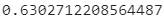
- Precision:
- Recall:

### Undersampling

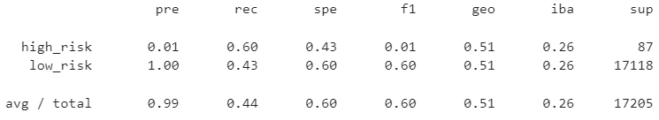

- Balanced Accuracy: 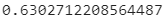
- Precision:
- Recall:

### Combination OverUnder Sampling

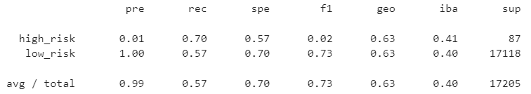

- Balanced Accuracy: 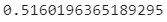
- Precision:
- Recall:

### Balanced Random Forest Classifier

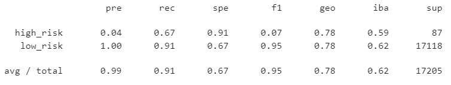

- Balanced Accuracy: 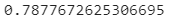
- Precision:
- Recall:

### Easy Ensemble AdaBoost Classifier

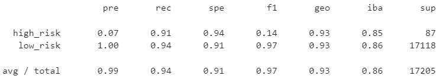

- Balanced Accuracy: 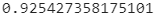
- Precision:
- Recall:

## Summary

Summarize the results of the machine learning models, and include a recommendation on the model to use, if any. If you do not recommend any of the models, justify your reasoning
There is a recommendation on which model to use, or there is no recommendation with a justification
