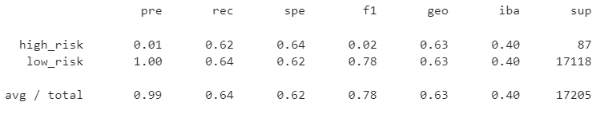

# Credit_Risk_Analysis

## Overview
The purpose of this challenge is to apply our machine learning skills to help sovle a real-world challenge: credit card risk.  By employing different techniques to train and evaluate models with umblanced classes we will develop a final recommendation on which, if any, models are the best for future use.

## Machine Learning Model Results

### Naive Random Oversampling

- Balanced Accuracy: 
- High-risk loan precision: low - 0.01
- Low-risk loan precision: high - 1.00
- High-risk loan recall: .62
- Low-risk loan precission: .65

### SMOTE Oversampling

- Balanced Accuracy: 
- High-risk loan precision: low - 0.01
- Low-risk loan precision: high - 1.00
- High-risk loan recall: .62
- Low-risk loan precission: .64

### Undersampling

- Balanced Accuracy: 
- High-risk loan precision: low - 0.01
- Low-risk loan precision: high - 1.00
- High-risk loan recall: .60
- Low-risk loan precission: .43

### Combination OverUnder Sampling

- Balanced Accuracy: 
- High-risk loan precision: low - 0.01
- Low-risk loan precision: high - 1.00
- High-risk loan recall: .70
- Low-risk loan precission: .57

### Balanced Random Forest Classifier

- Balanced Accuracy: 
- High-risk loan precision: low - 0.04
- Low-risk loan precision: high - 1.00
- High-risk loan recall: .67
- Low-risk loan precission: .91

### Easy Ensemble AdaBoost Classifier

- Balanced Accuracy: 
- High-risk loan precision: low - 0.07
- Low-risk loan precision: high - 1.00
- High-risk loan recall: .91
- Low-risk loan precission: .94

## Summary
In summary, when selecting a machine learning model it is best to select a model with accuracy closest to 1. For the credit card data set, the recommendation would be to use the Easy Ensemble AdaBoost Classifier - as this model had the highest balanced accuracy (.9254)

